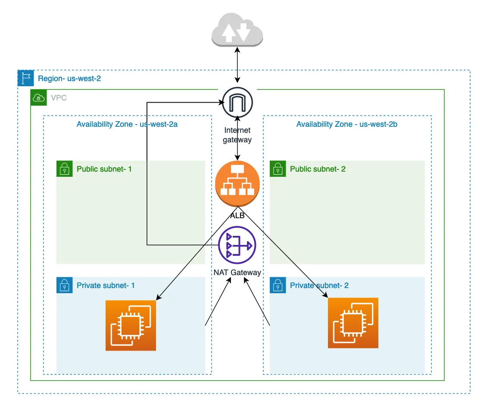

## Project

This project sets up a secure and scalable infrastructure on AWS using Terraform. It includes the following components:
- A VPC with public and private subnets across two availability zones.
- An Internet Gateway and a NAT Gateway for internet access.
- Security groups to control inbound and outbound traffic.
- An Application Load Balancer (ALB) to distribute traffic to EC2 instances in private subnets.

## Usage

To set up your environment, export your AWS credentials as environment variables:

```sh
export AWS_ACCESS_KEY_ID="your_access_key"
export AWS_SECRET_ACCESS_KEY="your_secret_key"
# Optional
export AWS_SESSION_TOKEN="your_session_token"
```

Then, initialize and apply the Terraform configuration:

```sh
terraform init
terraform apply
```

## Terraform Documentation

To generate the Terraform documentation, run:

```sh
terraform-docs markdown . > README.md
```

## Diagram



<!-- BEGIN_TF_DOCS -->
## Requirements

| Name | Version |
|------|---------|
| <a name="requirement_aws"></a> [aws](#requirement\_aws) | ~> 5.0 |

## Providers

| Name | Version |
|------|---------|
| <a name="provider_aws"></a> [aws](#provider\_aws) | 5.84.0 |
| <a name="provider_template"></a> [template](#provider\_template) | 2.2.0 |

## Modules

No modules.

## Resources

| Name | Type |
|------|------|
| [aws_eip.nat_eip](https://registry.terraform.io/providers/hashicorp/aws/latest/docs/resources/eip) | resource |
| [aws_instance.web](https://registry.terraform.io/providers/hashicorp/aws/latest/docs/resources/instance) | resource |
| [aws_internet_gateway.igw](https://registry.terraform.io/providers/hashicorp/aws/latest/docs/resources/internet_gateway) | resource |
| [aws_lb.alb](https://registry.terraform.io/providers/hashicorp/aws/latest/docs/resources/lb) | resource |
| [aws_lb_listener.alb-listener](https://registry.terraform.io/providers/hashicorp/aws/latest/docs/resources/lb_listener) | resource |
| [aws_lb_target_group.alb-target-group](https://registry.terraform.io/providers/hashicorp/aws/latest/docs/resources/lb_target_group) | resource |
| [aws_lb_target_group_attachment.alb_tg_attachment](https://registry.terraform.io/providers/hashicorp/aws/latest/docs/resources/lb_target_group_attachment) | resource |
| [aws_nat_gateway.nat](https://registry.terraform.io/providers/hashicorp/aws/latest/docs/resources/nat_gateway) | resource |
| [aws_route_table.private_route_table](https://registry.terraform.io/providers/hashicorp/aws/latest/docs/resources/route_table) | resource |
| [aws_route_table.public_route_table](https://registry.terraform.io/providers/hashicorp/aws/latest/docs/resources/route_table) | resource |
| [aws_route_table_association.private_subnet_associations](https://registry.terraform.io/providers/hashicorp/aws/latest/docs/resources/route_table_association) | resource |
| [aws_route_table_association.public_subnet_associations](https://registry.terraform.io/providers/hashicorp/aws/latest/docs/resources/route_table_association) | resource |
| [aws_security_group.alb-sg](https://registry.terraform.io/providers/hashicorp/aws/latest/docs/resources/security_group) | resource |
| [aws_security_group.ec2-sg](https://registry.terraform.io/providers/hashicorp/aws/latest/docs/resources/security_group) | resource |
| [aws_subnet.private_subnets](https://registry.terraform.io/providers/hashicorp/aws/latest/docs/resources/subnet) | resource |
| [aws_subnet.public_subnets](https://registry.terraform.io/providers/hashicorp/aws/latest/docs/resources/subnet) | resource |
| [aws_vpc.private_vpc](https://registry.terraform.io/providers/hashicorp/aws/latest/docs/resources/vpc) | resource |
| [aws_security_group.default](https://registry.terraform.io/providers/hashicorp/aws/latest/docs/data-sources/security_group) | data source |
| [template_file.user_data](https://registry.terraform.io/providers/hashicorp/template/latest/docs/data-sources/file) | data source |

## Inputs

| Name | Description | Type | Default | Required |
|------|-------------|------|---------|:--------:|
| <a name="input_alb_egress_rules"></a> [alb\_egress\_rules](#input\_alb\_egress\_rules) | List of egress rules for the ALB security group | <pre>list(object({<br/>    from_port       = number,<br/>    to_port         = number,<br/>    protocol        = string,<br/>    cidr_blocks     = list(string),<br/>    security_groups = optional(list(string), [])<br/>  }))</pre> | <pre>[<br/>  {<br/>    "cidr_blocks": [<br/>      "0.0.0.0/0"<br/>    ],<br/>    "from_port": 0,<br/>    "protocol": "-1",<br/>    "to_port": 0<br/>  }<br/>]</pre> | no |
| <a name="input_alb_ingress_rules"></a> [alb\_ingress\_rules](#input\_alb\_ingress\_rules) | List of ingress rules for the ALB security group | <pre>list(object({<br/>    from_port       = number,<br/>    to_port         = number,<br/>    protocol        = string,<br/>    cidr_blocks     = list(string),<br/>    security_groups = optional(list(string), [])<br/>  }))</pre> | <pre>[<br/>  {<br/>    "cidr_blocks": [<br/>      "0.0.0.0/0"<br/>    ],<br/>    "from_port": 80,<br/>    "protocol": "tcp",<br/>    "to_port": 80<br/>  }<br/>]</pre> | no |
| <a name="input_alb_internal"></a> [alb\_internal](#input\_alb\_internal) | Whether the ALB is internal | `bool` | `false` | no |
| <a name="input_alb_listener_port"></a> [alb\_listener\_port](#input\_alb\_listener\_port) | Port for the ALB listener | `number` | `80` | no |
| <a name="input_alb_listener_protocol"></a> [alb\_listener\_protocol](#input\_alb\_listener\_protocol) | Protocol for the ALB listener | `string` | `"HTTP"` | no |
| <a name="input_alb_listeners"></a> [alb\_listeners](#input\_alb\_listeners) | Map of ALB listeners | <pre>map(object({<br/>    port     = number<br/>    protocol = string<br/>  }))</pre> | <pre>{<br/>  "http": {<br/>    "port": 80,<br/>    "protocol": "HTTP"<br/>  }<br/>}</pre> | no |
| <a name="input_alb_name"></a> [alb\_name](#input\_alb\_name) | Name of the Application Load Balancer | `string` | `"alb"` | no |
| <a name="input_alb_sg_name"></a> [alb\_sg\_name](#input\_alb\_sg\_name) | Name of the ALB security group | `string` | `"alb-sg"` | no |
| <a name="input_alb_sg_tag"></a> [alb\_sg\_tag](#input\_alb\_sg\_tag) | Tag for the ALB security group | `string` | `"alb-security-group"` | no |
| <a name="input_alb_tag"></a> [alb\_tag](#input\_alb\_tag) | Tag for the ALB | `string` | `"alb"` | no |
| <a name="input_alb_target_group_tag"></a> [alb\_target\_group\_tag](#input\_alb\_target\_group\_tag) | Tag for the ALB target group | `string` | `"alb-target-group"` | no |
| <a name="input_alb_type"></a> [alb\_type](#input\_alb\_type) | Type of the Application Load Balancer | `string` | `"application"` | no |
| <a name="input_allow_all_cidr"></a> [allow\_all\_cidr](#input\_allow\_all\_cidr) | CIDR block for allowing all traffic | `string` | `"0.0.0.0/0"` | no |
| <a name="input_ami_id"></a> [ami\_id](#input\_ami\_id) | AMI ID for the EC2 instance | `string` | `"ami-005fc0f236362e99f"` | no |
| <a name="input_availability_zone_1"></a> [availability\_zone\_1](#input\_availability\_zone\_1) | Availability zone for the first subnet | `string` | `"us-east-1a"` | no |
| <a name="input_availability_zone_2"></a> [availability\_zone\_2](#input\_availability\_zone\_2) | Availability zone for the second subnet | `string` | `"us-east-1b"` | no |
| <a name="input_aws_region"></a> [aws\_region](#input\_aws\_region) | AWS region | `string` | `"us-east-1"` | no |
| <a name="input_ec2_egress_rules"></a> [ec2\_egress\_rules](#input\_ec2\_egress\_rules) | List of egress rules for the EC2 security group | <pre>list(object({<br/>    from_port   = number<br/>    to_port     = number<br/>    protocol    = string<br/>    cidr_blocks = list(string)<br/>  }))</pre> | <pre>[<br/>  {<br/>    "cidr_blocks": [<br/>      "0.0.0.0/0"<br/>    ],<br/>    "from_port": 0,<br/>    "protocol": "-1",<br/>    "to_port": 0<br/>  }<br/>]</pre> | no |
| <a name="input_ec2_ingress_rules"></a> [ec2\_ingress\_rules](#input\_ec2\_ingress\_rules) | List of ingress rules for the EC2 security group | <pre>list(object({<br/>    from_port       = number<br/>    to_port         = number<br/>    protocol        = string<br/>    cidr_blocks     = list(string)<br/>    security_groups = optional(list(string), [])<br/>  }))</pre> | <pre>[<br/>  {<br/>    "cidr_blocks": [],<br/>    "from_port": 0,<br/>    "protocol": "-1",<br/>    "to_port": 0<br/>  },<br/>  {<br/>    "cidr_blocks": [<br/>      "0.0.0.0/0"<br/>    ],<br/>    "from_port": -1,<br/>    "protocol": "icmp",<br/>    "to_port": -1<br/>  },<br/>  {<br/>    "cidr_blocks": [],<br/>    "from_port": 80,<br/>    "protocol": "tcp",<br/>    "security_groups": [<br/>      "alb_sg_placeholder"<br/>    ],<br/>    "to_port": 80<br/>  },<br/>  {<br/>    "cidr_blocks": [<br/>      "0.0.0.0/0"<br/>    ],<br/>    "from_port": 22,<br/>    "protocol": "tcp",<br/>    "to_port": 22<br/>  }<br/>]</pre> | no |
| <a name="input_ec2_name_tag"></a> [ec2\_name\_tag](#input\_ec2\_name\_tag) | Name tag for the EC2 instance | `string` | `"web-instance"` | no |
| <a name="input_ec2_sg_name"></a> [ec2\_sg\_name](#input\_ec2\_sg\_name) | Name of the EC2 security group | `string` | `"ec2-sg"` | no |
| <a name="input_ec2_sg_tag"></a> [ec2\_sg\_tag](#input\_ec2\_sg\_tag) | Tag for the EC2 security group | `string` | `"ec2-security-group"` | no |
| <a name="input_health_check_healthy_threshold"></a> [health\_check\_healthy\_threshold](#input\_health\_check\_healthy\_threshold) | Healthy threshold for the health check | `number` | `3` | no |
| <a name="input_health_check_interval"></a> [health\_check\_interval](#input\_health\_check\_interval) | Interval for the health check | `number` | `45` | no |
| <a name="input_health_check_path"></a> [health\_check\_path](#input\_health\_check\_path) | Path for the health check | `string` | `"/"` | no |
| <a name="input_health_check_timeout"></a> [health\_check\_timeout](#input\_health\_check\_timeout) | Timeout for the health check | `number` | `5` | no |
| <a name="input_health_check_unhealthy_threshold"></a> [health\_check\_unhealthy\_threshold](#input\_health\_check\_unhealthy\_threshold) | Unhealthy threshold for the health check | `number` | `3` | no |
| <a name="input_icmp_access_cidr"></a> [icmp\_access\_cidr](#input\_icmp\_access\_cidr) | CIDR block for ICMP access | `string` | `"0.0.0.0/0"` | no |
| <a name="input_instance_access_cidr"></a> [instance\_access\_cidr](#input\_instance\_access\_cidr) | CIDR block for instance access | `string` | `"0.0.0.0/0"` | no |
| <a name="input_instance_access_port"></a> [instance\_access\_port](#input\_instance\_access\_port) | List of ports for instance access | `number` | `22` | no |
| <a name="input_instance_type"></a> [instance\_type](#input\_instance\_type) | Instance type for the EC2 instance | `string` | `"t3.micro"` | no |
| <a name="input_internet_gateway_tag"></a> [internet\_gateway\_tag](#input\_internet\_gateway\_tag) | Tag name for the internet gateway | `string` | `"internet-gateway"` | no |
| <a name="input_key_name"></a> [key\_name](#input\_key\_name) | Name of the key pair | `string` | `"web-key"` | no |
| <a name="input_linux_distro"></a> [linux\_distro](#input\_linux\_distro) | Linux distribution for the EC2 instance | `string` | `"ubuntu"` | no |
| <a name="input_nat_gateway_tag"></a> [nat\_gateway\_tag](#input\_nat\_gateway\_tag) | Tag name for the NAT gateway | `string` | `"nat-gateway"` | no |
| <a name="input_private_route_table_tag"></a> [private\_route\_table\_tag](#input\_private\_route\_table\_tag) | Tag name for the private route table | `string` | `"private-route-table"` | no |
| <a name="input_private_subnet_1_cidr"></a> [private\_subnet\_1\_cidr](#input\_private\_subnet\_1\_cidr) | CIDR block for the first private subnet | `string` | `"10.0.3.0/24"` | no |
| <a name="input_private_subnet_1_tag"></a> [private\_subnet\_1\_tag](#input\_private\_subnet\_1\_tag) | Tag name for the first private subnet | `string` | `"private-subnet-1"` | no |
| <a name="input_private_subnet_2_cidr"></a> [private\_subnet\_2\_cidr](#input\_private\_subnet\_2\_cidr) | CIDR block for the second private subnet | `string` | `"10.0.4.0/24"` | no |
| <a name="input_private_subnet_2_tag"></a> [private\_subnet\_2\_tag](#input\_private\_subnet\_2\_tag) | Tag name for the second private subnet | `string` | `"private-subnet-2"` | no |
| <a name="input_project_tag"></a> [project\_tag](#input\_project\_tag) | Tags for the project | `map(string)` | <pre>{<br/>  "Owner": "Aleksandre_Mikashavidze",<br/>  "Project": "epam-tf-lab",<br/>  "Terraform": "true"<br/>}</pre> | no |
| <a name="input_public_route_table_tag"></a> [public\_route\_table\_tag](#input\_public\_route\_table\_tag) | Tag name for the public route table | `string` | `"public-route-table"` | no |
| <a name="input_public_subnet_1_cidr"></a> [public\_subnet\_1\_cidr](#input\_public\_subnet\_1\_cidr) | CIDR block for the first public subnet | `string` | `"10.0.1.0/24"` | no |
| <a name="input_public_subnet_1_tag"></a> [public\_subnet\_1\_tag](#input\_public\_subnet\_1\_tag) | Tag name for the first public subnet | `string` | `"public-subnet-1"` | no |
| <a name="input_public_subnet_2_cidr"></a> [public\_subnet\_2\_cidr](#input\_public\_subnet\_2\_cidr) | CIDR block for the second public subnet | `string` | `"10.0.2.0/24"` | no |
| <a name="input_public_subnet_2_tag"></a> [public\_subnet\_2\_tag](#input\_public\_subnet\_2\_tag) | Tag name for the second public subnet | `string` | `"public-subnet-2"` | no |
| <a name="input_target_group_name"></a> [target\_group\_name](#input\_target\_group\_name) | Name of the target group | `string` | `"target"` | no |
| <a name="input_target_group_port"></a> [target\_group\_port](#input\_target\_group\_port) | Port for the target group | `number` | `80` | no |
| <a name="input_target_group_protocol"></a> [target\_group\_protocol](#input\_target\_group\_protocol) | Protocol for the target group | `string` | `"HTTP"` | no |
| <a name="input_target_group_slow_start"></a> [target\_group\_slow\_start](#input\_target\_group\_slow\_start) | Slow start duration for the target group | `number` | `30` | no |
| <a name="input_volume_size"></a> [volume\_size](#input\_volume\_size) | Size of the root block device in GB | `number` | `8` | no |
| <a name="input_volume_type"></a> [volume\_type](#input\_volume\_type) | List of volume types for the root block device | `string` | `"gp3"` | no |
| <a name="input_vpc_cidr"></a> [vpc\_cidr](#input\_vpc\_cidr) | CIDR block for the VPC | `string` | `"10.0.0.0/16"` | no |
| <a name="input_vpc_tag_name"></a> [vpc\_tag\_name](#input\_vpc\_tag\_name) | Tag name for the VPC | `string` | `"private-vpc"` | no |
| <a name="input_website_access_cidr"></a> [website\_access\_cidr](#input\_website\_access\_cidr) | CIDR block for website access | `string` | `"0.0.0.0/0"` | no |
| <a name="input_website_access_port"></a> [website\_access\_port](#input\_website\_access\_port) | List of ports for website access | `number` | `80` | no |

## Outputs

| Name | Description |
|------|-------------|
| <a name="output_alb_dns_name"></a> [alb\_dns\_name](#output\_alb\_dns\_name) | The DNS name of the Application Load Balancer |
| <a name="output_ec2_private_ips"></a> [ec2\_private\_ips](#output\_ec2\_private\_ips) | The private IP addresses of the EC2 instances |
| <a name="output_private_subnet_cidrs"></a> [private\_subnet\_cidrs](#output\_private\_subnet\_cidrs) | The CIDR blocks of the private subnets |
| <a name="output_public_subnet_cidrs"></a> [public\_subnet\_cidrs](#output\_public\_subnet\_cidrs) | The CIDR blocks of the public subnets |
<!-- END_TF_DOCS -->
